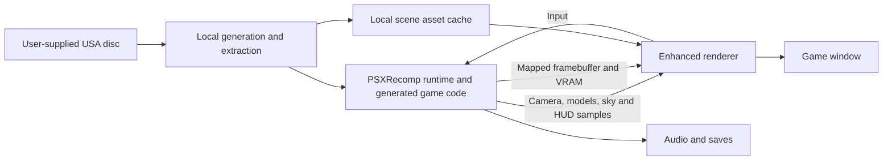

# Architecture and build pipeline

Start with the [technical overview](TECHNICAL_OVERVIEW.md). This project preserves
the original simulation while replacing its visible 3D presentation. The runtime
and enhanced renderer are separate processes with different responsibilities.

## Runtime ownership

[PSXRecomp](https://github.com/mstan/psxrecomp) translates game MIPS code into C
and provides the runtime. Runtime fallback paths remain available; compiling the
project does not establish that every executed instruction was statically
translated. The original game owns physics, race progression, audio, saves and
replay. No independently advancing physics engine runs inside the viewer.

The viewer uses SDL and OpenGL to render scene geometry. The companion continues
performing original graphics work because VRAM uploads, menus and framebuffer
fallback depend on it. Hiding its window does not eliminate its graphics work or
alter its simulation rate.

On Mac, [native_scene.py](../launcher/native_scene.py) starts the pair, stages an
isolated companion configuration, forwards inputs and stops its owned children
when the session ends. Windows uses [Launch.ps1](../launcher/windows/Launch.ps1)
and [ProcessHost.ps1](../launcher/windows/ProcessHost.ps1). Shared user preferences
must not be overwritten with the companion's temporary window settings.

## Local generation and extraction

The build pipeline has five stages:

1. Initialize pinned submodules and apply the recorded runtime patches.
2. Build PSXRecomp's generation tools. Read the supplied disc using
   [game.toml](../game.toml), including its revision checks and hook configuration.
3. Generate game C into the ignored `generated/` directory and extract the boot
   executable into ignored `disc/`. Compile the runtime and viewer.
4. Prepare the native scene cache. An isolated runtime session produces palette
   data; the extractor decodes course geometry, model data and textures locally.
5. Stage a playable folder in ignored `dist/macos/` or `dist/windows/`, including
   the owner's local disc data and the applicable dependency notices.

[prepare_native_scene.py](../tools/prepare_native_scene.py) hashes the extractor,
boot executable and disc probe metadata to identify its cache. On a cache miss it
runs [run_scene_validation.py](../tools/run_scene_validation.py) for an isolated
capture when palette data is needed, checks the VRAM size, and calls
[extract_scene_assets.py](../tools/extract_scene_assets.py). The exported asset is
written in a temporary directory and replaces the old asset after successful
extraction. Cache validity also checks the recorded asset size; this is not a
cryptographic verification of every cache byte.

The capture supplies texture/palette state that cannot be assumed from static
geometry alone. Its saves are isolated from normal play. Build completion without
successful asset preparation is insufficient for enhanced mode.

The Mac scripts use Apple Clang, Swift and Homebrew dependencies. The native
Windows script uses MSYS2 UCRT64, compiles generation tools on Windows, and selects
`build-windows` for asset preparation. The separate Mac-to-Windows cross-build
script is a development convenience, not validation of that native workflow.

## Capturing game state

The maintained boundaries are [codegen_setup.c](../codegen_setup.c),
[symbols.toml](../symbols.toml), [game.toml](../game.toml) and the hooks under
[src/scene](../src/scene). [usa_layout.h](../src/scene/usa_layout.h) centralizes
important guest addresses. Generated shards are disposable: change the hook or
generation configuration instead of editing generated game C.

- [live.c](../src/scene/live.c) publishes scene samples and receives input.
- [models.c](../src/scene/models.c) captures model submissions, owner identity and
  transforms; additional read-only reconstruction completes supported objects.
- [sky.c](../src/scene/sky.c) and [hud.c](../src/scene/hud.c) publish their layers.
- [screen.c](../src/scene/screen.c) and [vram.c](../src/scene/vram.c) expose original
  framebuffer and texture memory to the viewer.

Guest matrices remain fixed-point in the live scene protocol; conversion and
interpolation happen on the viewer side. Verify address meaning, caller identity,
units and supported states against the exact executable before extending a hook.

## Transport and consistency

[transport.h](../src/platform/transport.h) uses nonblocking Unix-domain datagrams
on Mac and loopback UDP on Windows. Windows discovers a session's port through a
local endpoint file. This is same-host IPC, not a remote multiplayer protocol.
Framebuffer and VRAM use [mapped files](../src/platform/mapped_file.h).

[live_protocol.h](../src/scene/live_protocol.h) defines magic values, sequence IDs,
fixed-size scene headers and bounded model chunks. [live_client.h](../src/scene/live_client.h)
checks lengths, sequence association, counts and offsets while assembling data.
Do not merge a previous scene's model chunks into a newer sample. Protocol changes
must update producer, consumer and delivery tests together; mixed-version
executables are not a supported configuration.

Dropping a visual sample must not block or repeat a simulation tick. Sequence-gap
and incomplete-frame counters help distinguish delivery problems from rendering
stalls. Input endpoint discovery is cached rather than reading a file every frame.

## Dependency modifications

The root repository pins upstream revisions rather than copying dependency history
into its own commits. [apply-runtime-patches.sh](../scripts/apply-runtime-patches.sh)
applies patches idempotently without advancing those pins:

- [Hidden companion patch](../patches/psxrecomp-hidden-companion.patch): create the
  runtime window hidden for enhanced mode while preserving runtime execution.
- [GL readback-order patch](../patches/psxrecomp-gl-readback-order.patch): flush
  queued draw work before readback consumes dirty regions. Otherwise a diagnostic
  peek can leave later CPU framebuffer reads inconsistent with GPU contents.

These are part of a reproducible build. An unrecorded local submodule edit is not
available to another contributor's clone. Preserve upstream licences when adding
or changing patches.
